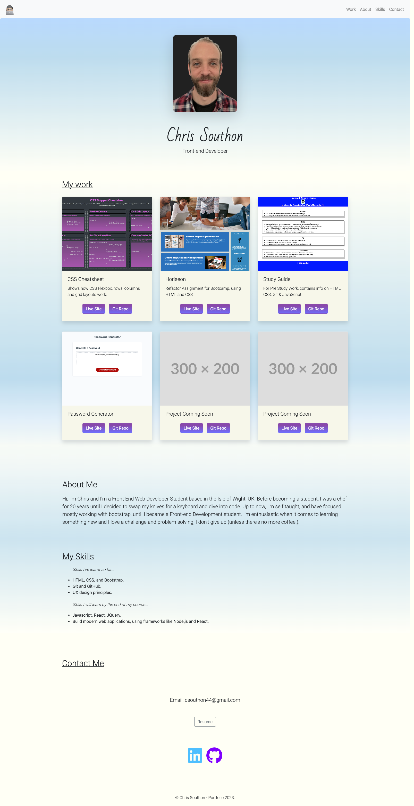

# Bootstrap-Portfolio
My Portfolio built using bootstrap

## Descripton

This is my Portfolio that includes work and assignments I have completed for my Front-End Developer Course, along with my skills and contact links.

## Built With
* Bootstrap
* HTML5
* CSS

## Screenshot

## Usage

You can view my Portfolio [here](https://chriscds.github.io/Bootstrap-Portfolio/index.html).
On my Portfolio webpage you will find links to my work.

## License

Please refer to the LICENSE in the repository.